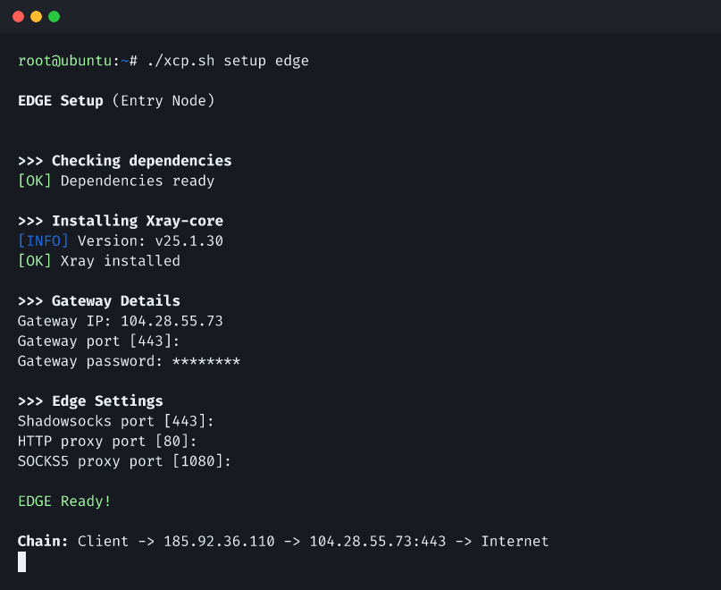

# Xray Chain Proxy

One-command chain proxy for bypassing internet censorship, built on [Xray-core](https://github.com/XTLS/Xray-core).




---

## Why Xray Chain Proxy?

Users in restricted networks can't access many websites directly. This tool creates an encrypted two-hop chain that's fast, reliable, and easy to replace if blocked.

```
┌────────┐      ┌────────┐      ┌─────────┐      ┌──────────┐
│ Client │ ──── │  EDGE  │ ──── │ GATEWAY │ ──── │ Internet │
│ (You)  │      │(Entry) │      │  (Exit) │      │          │
└────────┘      └────────┘      └─────────┘      └──────────┘
```

| Server    | Location            | Role                              |
| --------- | ------------------- | --------------------------------- |
| `EDGE`    | Restricted region   | Entry point, low latency to you   |
| `GATEWAY` | Unrestricted region | Exit point, fetches from internet |

- **EDGE** is close to you = low latency
- **GATEWAY** has free internet = unrestricted access
- Traffic between them is **AES-256-GCM encrypted**
- If EDGE gets blocked, just spin up a new one

## Features

- **3 protocols on one server** — Shadowsocks (443), HTTP (80), SOCKS5 (1080)
- **One-command setup** — Single script, no manual config files
- **Multi-user management** — Add unlimited users with shared credentials
- **QR code generation** — Scan to connect on mobile
- **Traffic statistics** — Per-user bandwidth monitoring
- **Routing rules** — Domain/IP-based rules with GeoIP and GeoSite support
- **Multi-architecture** — x86_64, ARM64, ARM32
- **Multi-hop chains** — Parallel or chained EDGE servers for redundancy

## Quick Start

```bash
# Download
curl -sL https://raw.githubusercontent.com/dalirnet/xray-chain-proxy/main/script.sh -o xcp.sh
chmod +x xcp.sh
```

**On your exit server** (unrestricted internet):

```bash
./xcp.sh setup gateway
```

**On your entry server** (restricted region):

```bash
./xcp.sh setup edge
```

That's it. Run `./xcp.sh user ls` to see credentials and QR codes.

## Protocols

| Protocol    | Port | Method        | Best For                        |
| ----------- | ---- | ------------- | ------------------------------- |
| Shadowsocks | 443  | `aes-256-gcm` | Mobile apps, best compatibility |
| HTTP        | 80   | Basic auth    | Browsers, curl                  |
| SOCKS5      | 1080 | Basic auth    | Apps, system-wide proxy         |

> All protocols share the same username and password.

## Commands

```
setup gateway|edge    Setup server role
start|stop|restart    Control Xray service
status                Show service status
user ls|add|rm        Manage users (with QR codes)
stats                 Per-user traffic statistics
logs [-f] [n]         View logs (follow mode)
test                  Test connection & speed
config ls|set         View/change configuration
rule ls|add|rm        Manage routing rules
update                Update script & Xray
uninstall             Remove everything
```

## Requirements

- Debian/Ubuntu with root access
- 512 MB RAM, 1 CPU minimum
- Dependencies: `curl`, `jq`, `unzip` (auto-checked)

## Documentation

Full documentation with guides, client recommendations, and advanced architectures:

**[dalirnet.github.io/xray-chain-proxy](https://dalirnet.github.io/xray-chain-proxy/)**

## Development

```bash
make test            # Run all tests
make lint            # Check syntax
make check-deps      # Verify dependencies
make version         # Show script version
```

## Contributing

Contributions are welcome! Please open an issue first to discuss what you'd like to change.

## License

[MIT](LICENSE)
