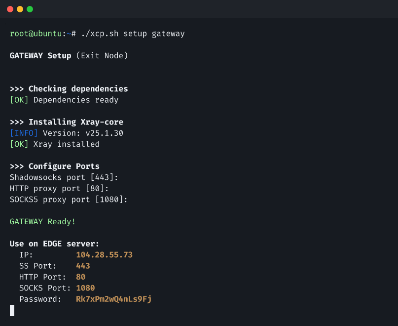
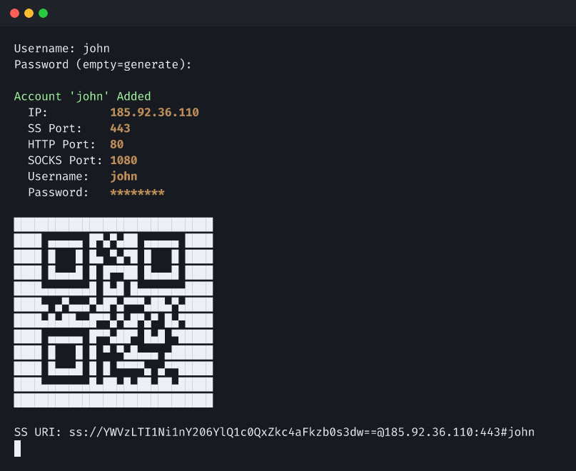
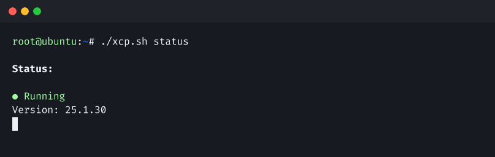
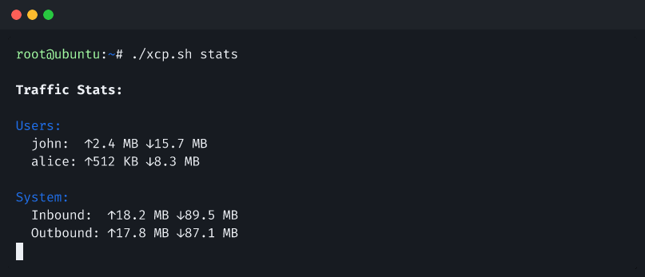
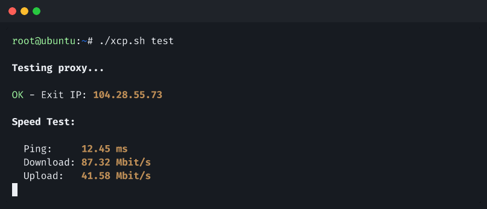
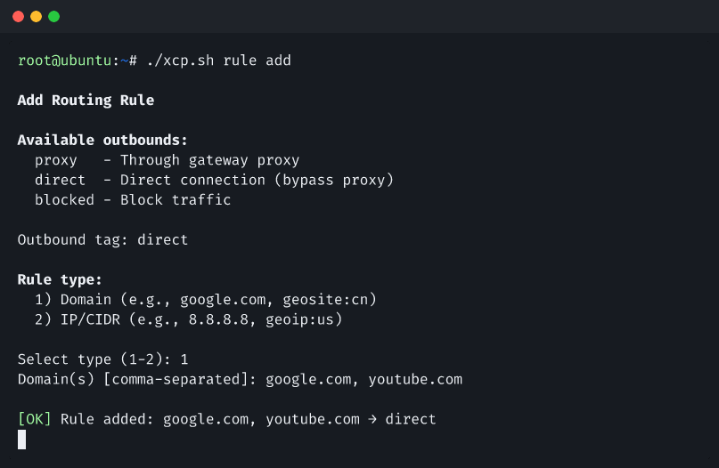

# Showcase

Visual guide to Xray Chain Proxy CLI commands.

## Setup Gateway

Start here. The gateway is your **exit node** — a server with unrestricted internet access. This command installs Xray-core, configures the ports, and outputs the IP, ports, and password you'll need when setting up the edge server. Keep these details handy.

```bash
./xcp.sh setup gateway
```



## Setup Edge

Next, set up the **entry node** — a server close to you in the restricted region. You'll be prompted for the gateway IP, port, and password from the previous step. Once connected, the encrypted chain between edge and gateway is established.

```bash
./xcp.sh setup edge
```


## Add User

Add a client account to the edge server. Enter a username and optionally a password (leave empty to auto-generate). The output includes the server IP, ports, credentials, a QR code for mobile apps, and a Shadowsocks URI you can copy directly into your client.

```bash
./xcp.sh user add
```



## Status

Quick health check. Shows whether the Xray service is running and the installed version.

```bash
./xcp.sh status
```



## Traffic Stats

See how much bandwidth each user has consumed, along with total system inbound and outbound traffic. Useful for monitoring usage and identifying heavy users.

```bash
./xcp.sh stats
```



## Test Connection

End-to-end verification. Tests that traffic flows through the full chain and reports the exit IP (should match your gateway), ping latency, download and upload speeds.

```bash
./xcp.sh test
```



## Add Routing Rule

Fine-tune how traffic is handled. Choose an outbound (proxy, direct, or blocked), select a rule type (domain or IP/CIDR), and specify the targets. For example, route specific domains directly to bypass the proxy, or block unwanted traffic entirely.

```bash
./xcp.sh rule add
```


